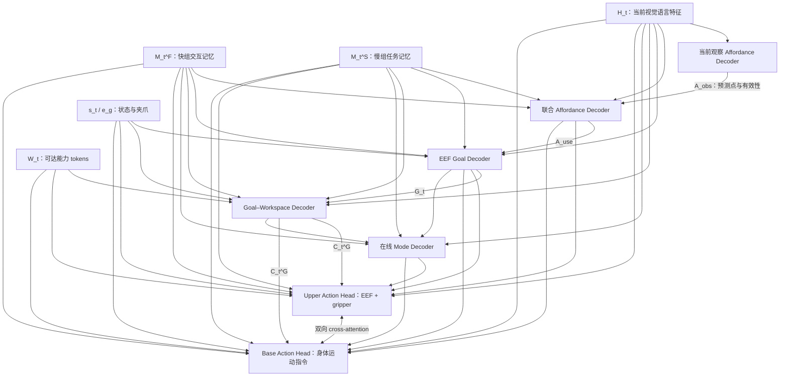
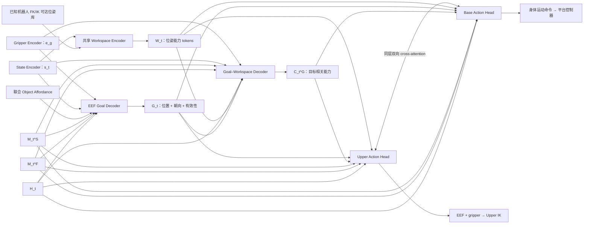

# MobileBench Method v1.2
## 能力条件化动作生成与 Affordance-Grounded 双时间尺度隐式记忆

**状态：研究设计稿，尚未验证实验收益。**  
**主干：π0.5；任务：无预建地图的跨具身长程移动操作。**  
**基础范围：**保留已讨论的 EEF goal、可达性编码、上下半身双动作分支及双向 cross-attention；将记忆具体化为快慢两组，新增导航与物体 affordance 点监督。已知机器人共同训练、使用同一 checkpoint；不承诺未见本体零样本接入。底盘动力学适配沿用对应执行接口，本版不额外声称已经解决跨平台动力学辨识。


**相对 v1.1 的本轮修改：**

1. 明确增加 **\(H_t\rightarrow\) Current-observation Affordance Decoder**，直接预测当前观察中的 NAV／object affordance；原有记忆条件化读出保留，改为同时读取 \(H_t,M_t^F,M_t^S\)，产生实际供策略使用的点。
2. 细化 **EEF Goal Decoder → Goal–Workspace Decoder → 双 Action Decoder**：明确输入、query、key/value、位置与朝向输出、有效性、NULL 和执行参考系。
3. 修正架构图与公式：**\(H_t,M_t^F,M_t^S\) 都直接连接主要任务 decoders 和两个 Action Head**，并非只经过几个点或一个 goal 间接影响动作。Trace／slow-text 仍是有意限制输入的记忆监督支路。

本轮是模型设计文档的修订，没有改变 π0.5 主干、两组隐式记忆及已见具身共享训练的定位；文中配置是待验证的实现起点，不代表已完成训练。

---

## 1. 核心问题与方法概述

统一 EEF 控制只统一了动作表达，没有统一不同机器人的可执行范围。与此同时，移动会改变视角并使任务对象暂时不可见：模型不能只知道当前画面有什么，还要保留先前看见的目标、近期交互过程和长程任务进度。

本方法将两条机制连接起来：

- **Cross-embodiment：**通过已知机器人可达位姿库、当前状态及夹爪描述，建立目标相关的能力条件；上下身两个动作分支联合决定如何实现同一个任务目标。
- **Memory：**当前特征 H_t 直接预测当前观察的 affordance；快组保存视觉—运动交互信息，以 EEF history trace、导航／物体 affordance 和 EEF goal 为主要几何监督；慢组保存阶段、对象、持物状态及目的地，以短文本语义对齐为主要监督。

两组长期保存的都是 latent tokens，而不是图像缓存、轨迹记录库、文字日志或显式地图。几何／语言读出是监督和决策接口，不改变主要记忆载体的隐式性质。传感器采样到两次策略调用之间的小段新增运动可以暂存，但不保留完整 episode 的显式历史供策略检索。

**方法中心不是首次使用快慢记忆，而是：利用仿真提供的任务几何与阶段信息，定向约束两组记忆，并将其通过目标与能力接口落实到跨具身动作生成。**

---

## 2. 与相关工作的关系

### 2.1 ReMem-VLA：直接借鉴双时间尺度，不照搬整套方法

ReMem-VLA 维护 frame-level 与 chunk-level recurrent queries，分别密集和稀疏更新，采用固定 EMA 的跨时刻传播；action／hindsight queries 通过 connector 读取记忆，并以动作预测和过去 RGB 观察重建训练。[R1]

我们借鉴“不同时间尺度的递归状态”这一组织方式，不把它作为独立新意。具体改动是：

| 比较维度 | ReMem-VLA 原文机制 | 本方案拟研究的机制 |
|---|---|---|
| 记忆尺度 | Frame-level / chunk-level | 快／慢两组，同样承认这一来源 |
| 内容引导 | 动作监督与 Past Observation Prediction | 快组以 trace、两类 affordance、EEF goal 引导；慢组以阶段—对象—目的地文本引导 |
| 辅助视觉任务 | 恢复过去 RGB 图像 | 本版不以整图重建为主，研究任务相关的几何回忆 |
| 策略接口 | 记忆条件化动作预测 | 与 EEF goal、机器人可达范围、上下身联合动作生成结合 |
| 训练传播 | 文中采用 gradient-free recurrence；报告截断长度为 1 | 本版首先使用固定融合系数＋可训练 writer，并在短连续窗口内保留梯度；与 detached EMA 单独比较 |

这里不能写成“ReMem-VLA 只有视觉记忆、不懂任务阶段”：原文也讨论了任务进度和长程上下文。本方案的区别是更具体的监督分工和控制接口，而非否认其任务记忆能力。

### 2.2 不与 MemoryVLA、MEM 混淆

**MemoryVLA** 维护 perceptual-cognitive memory bank，检索并融合历史条目，容量到限时合并冗余项；它保存的也可以是 latent，所以“我们使用向量”不是区别。[R2] 本方案采用固定规模递归状态，不以历史条目库检索为主要机制。

**Physical Intelligence 的 MEM** 用短期视觉历史和长期自然语言记录保存上下文；长期文字会参与后续推理。[R3] 本方案用文字监督慢组，但不要求把生成文字保存并再次输入，长期载体仍为 latent。

**Affordance 也不是新增概念。**RoboPoint 已用合成数据训练图像点 affordance，支持导航和操作应用。[R4] 本方案拟研究的是这些点如何约束跨时刻记忆并服务于闭环动作，而非首次预测 affordance。

---

## 3. 输入、符号和部署边界

一次策略更新记为 \(t\)，不等于一个低层控制 tick，也不等于一个 flow-matching 去噪步。动作块长度记为 \(L_A\)，避免与当前视觉语言特征 \(H_t\) 混淆。

部署允许输入：当前机载图像 \(I_t\)、原始任务指令 \(l\)、当前本体测量 \(S_t\)、已发生的执行反馈、相邻更新间的实际运动估计，以及已知机器人 \(r\) 的结构／夹爪／可达性描述。

| 符号 | 含义 |
|---|---|
| \(H_t\in\mathbb R^{N_H\times d_H}\) | π0.5 对当前图像、原始指令和当前状态提取的干净上下文 tokens；不是一个必须池化的单向量 |
| \(M_t^F,M_t^S\) | 本轮更新后的快、慢记忆；\(M_t\) 仅是两者的统称，不新增第三组 memory |
| \(\xi_t\) | 自上次更新以来新增的实际 EEF、gripper、身体运动记录和时间信息 |
| \(s_t=E_S(S_t)\) | 编码后的连续本体状态 tokens，区别于原始测量 \(S_t\) |
| \(W_t\) | 已知机器人可达位姿与当前状态关系的能力 tokens |
| \(e_g,e_r^B\) | 夹爪描述，以及已确定的底盘／身体运动接口条件 |
| \(A_t^{obs}\) | 从 \(H_t\) 直接读出的当前观察 affordance：NAV 点、object 点及各自有效性 |
| \(A_t^{use}\) | 联合当前观察与快慢记忆后的任务 affordance；这是下游实际使用的预测 |
| \(\hat p_t^{j,obs},\hat v_t^{j,obs}\) | 当前观察分支的点与有效性，\(j\in\{N,O\}\) |
| \(\hat p_t^j,\hat v_t^j\) | 联合读出的点与有效性；不加 `obs` 上标时统一指实际使用的 \(A_t^{use}\) |
| \(\hat G_t=(\hat p_t^G,\hat R_t^G),\hat v_t^G\) | 下一关键 EEF 交互位姿与有效性 |
| \(C_t^G\) | 由任务 goal 查询 workspace 后得到的目标相关能力 tokens |
| \(\hat m_t\) | 在线预测的 NAV／MANIP 等控制模式 |
| \(Y_t^U,Y_t^B\) | 上身 EEF＋gripper 动作块、身体运动指令块 |

**无预建地图不等于无本体感知。**使用机载里程计或视觉里程计时必须报告，不能宣称纯 RGB。仿真的真实世界坐标、物体 ID、真实阶段和 NavMesh 只用于专家生成或监督标签，不作为部署时的额外输入。

\(H_t\) 的“当前观察”定义不包含历史图像缓存、生成的阶段文字或上一轮 memory。历史通过后接 memory connector 进入策略。因此 \(A_t^{obs}\) 与 \(A_t^{use}\) 的信息来源确实不同，而不只是把同一个预测换名字。

本版不增加主动相机视角控制模块。身体为完成任务正常转向，仍属于导航／移动操作行为。

---

## 4. 整体模型结构：当前感知、两组记忆都直接通向决策

本版保留 π0.5 主干后接双组 memory connector 的方案。增加当前观察 affordance 读出，但不要求先把 \(H_t\) 压成点，再让其他模块只读取点。

### 4.1 整体前向顺序

```text
当前 RGB、原始指令、当前状态
                │
                ▼
             π0.5 VLM
                │
               H_t ──> 当前观察 Affordance Decoder ──> A_obs
                │                                       │
                ├─> Fast Writer <─ 旧快组、旧慢组、新增运动 │
                │       │                               │
                │      M_t^F                            │
                ├─> Slow Writer <─ M_t^F、旧慢组、状态     │
                │       │                               │
                │      M_t^S                            │
                │                                       │
       H_t、M_t^F、M_t^S ────────────────┐               │
                │                       ▼               ▼
                │             联合 Affordance Decoder
                │                       │
                │                     A_use
                │                       │
                ├────────────> EEF Goal Decoder <─ 状态、夹爪
                │                       │
                │                     G_t
                │                       │
                ├────────────> Goal–Workspace Decoder <─ W_t
                │                       │
                │                     C_t^G
                │                       │
                ├────────────> Mode Decoder
                │                       │
                ├────────────> Upper Action Head <──> Base Action Head
                │                 ▲                       ▲
                └─────────────────┴───────────────────────┘
                        直接 latent 条件路径始终保留

训练专用：M_t^F → Trace Readout；M_t^S → Phase-text Readout。
两组 memory 保存到下一时刻；所有任务预测来自在线输入而非真值标签。
```

其中 \(A^{obs}\) 作为当前证据进入联合 affordance decoder；**不把两组点做坐标平均，也不要求历史目标必须等于当前可见点**。真正进入 goal 和动作条件的是联合预测 \(A^{use}\)。

### 4.2 主要 decoders 与动作分支的直接连线

下图专门展示本版补齐的直接输入路径。Mermaid 渲染器可显示可编辑流程图；不支持 Mermaid 的阅读器可直接参考上面的文本图及下方输入表。



**这里的直接箭头表示：该组原始 latent tokens 可以作为对应模块的 key/value 被读取，不是仅通过预测出的坐标、模式或文字间接传入。**实现上可以拼接为带类型标识的 tokens，也可以使用分组 cross-attention；两者不应在图中被误画成只有一个数值中间量。

### 4.3 主决策路径与辅助监督路径不能混画

| 模块 | 直接读取 \(H_t\) | 直接读取 \(M_t^F\) | 直接读取 \(M_t^S\) | 其他核心输入 |
|---|:---:|:---:|:---:|---|
| Current-observation Affordance Decoder | 是 | 否 | 否 | 当前状态／标定；原始任务语义来自 \(H_t\) |
| 联合 NAV／object Affordance Decoder | 是 | 是 | 是 | 预测 \(A^{obs}\)、类型 query、状态 |
| EEF Goal Decoder | 是 | 是 | 是 | 预测 object affordance、夹爪、当前状态 |
| Goal–Workspace Decoder | 是 | 是 | 是 | 预测 goal、\(W_t\)、状态、夹爪 |
| 在线 Mode Decoder | 是 | 是 | 是 | 预测 goal／affordance、能力关系 |
| Upper Action Head | 是 | 是 | 是 | 状态、能力、预测点／goal／模式、带噪上身动作 |
| Base Action Head | 是 | 是 | 是 | 同上及身体运动约束、带噪底盘动作 |
| Trace Readout〔训练用〕 | 否 | 是 | 否 | 历史间隔 query；不直接读取待重建历史 |
| Slow phase-text Readout〔训练用〕 | 否 | 否 | 是 | 冻结文本特征只出现在 loss 侧 |

最后两行是有意限制的例外：它们用于检查和约束特定记忆组，不能为了“每个 decoder 都连三条线”而给辅助任务新增绕开记忆的捷径。

### 4.4 建议的起始配置

| 组件 | 起始配置，均待验证 |
|---|---|
| 快／慢 memory | \(N_F=32,N_S=16,d=256\) |
| Fast／Slow Writer | 各 2 层 cross-attention＋FFN，4 heads |
| Slow 写入周期 | 每 \(K=4\) 次新观察更新写入一次；输入实际时间间隔 |
| 当前／联合 Affordance Decoder | 各 2 层、宽度 256；NAV、object 两个类型 queries |
| EEF Goal Decoder | 2 层、宽度 256、4 heads；每个有效末端一个 learned query |
| Goal–Workspace Decoder | 2 层双步 cross-attention；先读任务上下文，再读能力 tokens |
| Workspace tokens | 从离线库取覆盖位置与朝向的 \(N_W=256\) 个样本作为起点 |
| 双动作专家 | 继承所选 π0.5 checkpoint 的专家宽度与层配置；独立输入／输出投影，增加双向交互 |

这些数字不是原论文结论。辅助模块统一投影到 256 维，不意味着强制把原 π0.5 动作专家缩到 256 维。若采用双臂，复制末端 query／固定动作槽位并使用存在性 mask，不为每台机器人复制整套策略参数。

---

## 5. 双时间尺度记忆

### 5.1 快组：视觉—运动交互状态

Fast Writer 读取当前任务特征、新增实际运动及旧慢组：

\[
\widetilde M_t^F=U_F(M_{t-1}^F,H_t,E_\xi(\xi_t),M_{t-1}^S),
\]
\[
M_t^F=(1-\alpha_F)M_{t-1}^F+\alpha_F\widetilde M_t^F.
\]

U_F 以旧快组（加 slot embedding）为 queries，读取其余特征，经 residual attention／FFN 输出写入候选。alpha_F 为固定超参数。固定融合系数不等于固定 writer，也不等于自动获得无损长期记忆。

xi_t 来自实际执行：近期 EEF 位姿／增量、gripper 状态、身体相对运动、时间间隔及可获得的反馈。过去网络计划但未实际实现的动作，不能当成运动事实。

快组不是纯 proprioception 缓冲。同一 EEF trace 可能对应成功抓取或空抓，因此必须保留图像中的目标与交互证据。

### 5.2 慢组：任务阶段与对象上下文

在固定写入时刻：

\[
\widetilde M_t^S=U_S(M_{t-1}^S,H_t,M_t^F,s_t),
\]
\[
M_t^S=(1-\alpha_S)M_{t-1}^S+\alpha_S\widetilde M_t^S.
\]

其他时刻 M_t^S=M_{t-1}^S。慢组接收快组中已观察的执行结果，不仅接收最初的任务指令。

信息流没有循环：旧慢组指导本轮快组；新快组在写入时刻进入新慢组；随后解码本轮目标与动作。当前预测 goal 不作为当前 memory 更新的先决条件。

慢组保留阶段、当前对象、已完成事件、持物状态、目的地及后续任务所需的上下文。文本只监督其中一个语义读出，不将全部 slow tokens 强制压成一句话。需要跨房间保留的目标几何仍可通过 affordance／goal／action 损失学习，并由慢组传回快组。

### 5.3 稀疏更新不能锁死当前控制

慢组未到写入时刻时，当前模式判断仍读取 H_t、快组和执行反馈，不仅依靠旧 slow phase。阶段文本损失优先在慢组写入后计算；不能一边冻结 slow state，一边强迫它立即反映刚发生的新事件。

第一版不使用真实 subtask 边界触发写入。后续若增加提前写入，只能由在线可测或预测的事件触发，且训练／推理一致。

两组只在新 episode 重置，不因 NAV/MANIP 转换、目标改变或进入下一房间而全部清空。

---

## 6. Affordance 与局部几何：H_t 直接读出，记忆联合补充

### 6.1 EEF 历史轨迹监督保持不变

Trace Readout 从快组读取若干过去时刻的实际 EEF 位姿与 gripper 状态：

\[
\widehat{\mathcal T}^{past}_t=D_T(M_t^F,Q_{lag}).
\]

至少部分回忆时间早于本轮新增运动输入，避免仅复制 \(\xi_t\)。部署可移除 \(D_T\)。本版不把 \(H_t\) 直接接到该训练支路，否则正确重建可能来自当前画面的线索，而不是快组保留的历史。

历史状态统一到当前身体系时，标签为：

\[
{}^{B_t}T_{E_i}=({}^{O}T_{B_t})^{-1}\,{}^{O}T_{B_i}\,{}^{B_i}T_{E_i}.
\]

\(O\) 是局部里程计参考系，不要求全局地图。模型只输入部署可获得的运动估计；仿真真值用于构造标签时，应另外评估实际运动估计误差。刚体变换用于真实几何数据，不能直接作用于任意 latent 并宣称其几何等变。

### 6.2 点、位姿与身体能力的职责

| 输出 | 定义 | 不能替代什么 |
|---|---|---|
| NAV affordance \(p^N\) | 下一局部通行／接近点，如门口、通道入口、操作区域附近位置 | 不是完整路径，不保证底盘动力学可执行，不要求最终目的地一直可见 |
| Object affordance \(p^O\) | 当前任务作用区域，如把手接触点、抓取区域、放置支撑点；带有作用角色 | 不是任意物体中心，也不是完整 TCP 位姿 |
| EEF goal \(G\) | 给定夹爪和交互阶段的下一关键 TCP 位置与朝向 | 不要求每个短动作块立刻到达，不应被裁剪成任意可达点 |
| Workspace \(W_t\) | 已知身体的可达位姿与当前状态关系 | 不是任务目标，也不是全环境无碰撞规划器 |

两个 affordance 类型始终区分，不用一个未标类型的坐标同时表示导航和抓取。

### 6.3 新增：从 H_t 直接预测当前观察的 affordance

使用两个 learned queries：\(Q_N^{obs}\) 和 \(Q_O^{obs}\)。它们表示“读取 NAV 点”和“读取 object 点”，不携带真实目标坐标、真实对象 ID 或真实 phase。

\[
Z_t^{obs}
=D_A^{obs}\!\left(
[Q_N^{obs};Q_O^{obs}],\,[P_HH_t;s_t]
\right).
\]

\(D_A^{obs}\) 是小型 attention decoder：query self-attention → 对当前特征 cross-attention → FFN，重复两层。每个 query 的输出接位置 MLP 和有效性 MLP：

\[
\hat p_t^{j,obs}=\operatorname{MLP}_{p,j}(z_t^{j,obs})\in\mathbb R^3,
\qquad
\hat v_t^{j,obs}=\sigma(\operatorname{MLP}_{v,j}(z_t^{j,obs})),
\quad j\in\{N,O\}.
\]

于是：

\[
A_t^{obs}=\{(\hat p_t^{N,obs},\hat v_t^{N,obs}),
(\hat p_t^{O,obs},\hat v_t^{O,obs})\}.
\]

**这就是明确的 \(H_t\rightarrow\) affordance 点输出。**本分支不读取快慢组，因此监督口径是“由当前输入能够确定的点”。若只有历史才能确定具体对象或局部目标，应允许当前分支无效，而不是逼它凭当前画面猜历史。

起始版本输出当前身体／局部系的三维点；相机内外参及深度输入是否使用应在配置中固定。不使用深度时，三维读出是受监督估计，不宣称纯单帧 RGB 对任意场景都能无歧义恢复尺度。二维 heatmap 可作为可见点的附加读出，但不替代下面的历史空间预测。

### 6.4 保留并修订：当前观察与两组记忆联合读出任务 affordance

原来仅从快组读点，现改为读取三类原始特征，同时把 \(A^{obs}\) 作为带来源标记的当前证据：

\[
K_t^A=
[P_HH_t+e_H;\ P_FM_t^F+e_F;\ P_SM_t^S+e_S;\ s_t;\ E_{obs}(A_t^{obs})].
\]

\[
Z_t^A=D_A^{use}([Q_N^{use};Q_O^{use}],K_t^A),
\]

\[
(\hat p_t^j,\hat v_t^j)=\operatorname{Readout}_j(z_t^{A,j}),
\quad j\in\{N,O\}.
\]

\(e_H,e_F,e_S\) 区分信息来源。\(E_{obs}\) 编码类型、预测坐标与有效性；无效预测使用带类型的 NULL 表示，不把占位原点当真实点。

**两条分支的分工：**

- \(A^{obs}\)：当前观察提供什么空间证据？
- \(A^{use}\)：结合当前观察、历史和任务进度，此刻应该使用什么目标？

\(D_A^{use}\) 是决策用 decoder，不是把两组坐标求平均的算子。目标暂时不可见时，\(A^{obs}\) 可以为空，\(A^{use}\) 仍可依据历史有效；重见目标时，联合读出可以利用新证据修正旧估计。不预设这种能力已经由 attention 自动保证，需要做记忆与重见目标测试。

**下游 Goal 和 Action 使用 \(A^{use}\)；\(H_t,M_t^F,M_t^S\) 仍直接供下游读取，不被这两个三维点替代。**当前分支输出不直接作为本轮 memory 写入的必要条件；writer 仍按第 5 节读取 \(H_t\) 和执行记录，避免额外改动递归结构。

### 6.5 当前分支与联合分支不能使用相同的有效性定义

| 样本情况 | 当前分支 \(v^{j,obs*}\) | 联合分支 \(v^{j*}\) |
|---|---|---|
| 当前输入足以定位并确定目标角色 | 监督当前点 | 监督任务点 |
| 当前不可见，但历史足够定位当前任务目标 | 当前分支可无效，不计算精确点误差 | 继续监督点与历史保持 |
| 可见多个对象，但只有历史才能确认应选哪个 | 不强制当前分支唯一选中历史指定对象 | 由历史条件监督正确目标 |
| 从未获得信息或历史不足以确定精确位置 | 不强迫猜测 | 可为 NULL；仍可保留语义任务记忆 |
| 遮挡后物体发生未观察的移动 | 不监督未观察到的新位置 | 不能把隐藏新位置当作应被“记住”的真值 |

可见性、可知性、可达性使用不同 mask。若当前／联合分支指向不同的合法中间目标，不强行施加逐点相等约束。多条通路或多个接触点都有效时，使用候选集合／多模态目标，不平均成不可行中点。

仿真可获得两类 affordance 用于监督，但策略不读取真实点。NAV 专家若使用完全隐藏的地图决定唯一岔路选择，应区分专家蒸馏与可由历史恢复的记忆监督；这种信息不对称不能算成模型遗忘。

### 6.6 EEF Goal 的连接和 NAV 下的 NULL

EEF Goal Decoder 直接读取 \(H_t,M_t^F,M_t^S\)，再结合联合 object affordance、状态和夹爪输出位姿；其内部结构详见第 8.3 节。

**NAV 不自动屏蔽 goal。**目标已知但上身够不到时，保留 goal；尚不具备精确交互位姿时，输出有效性低／NULL。NULL 不等于原点，也不直接送给 IK。

即使 EEF goal 为空，上身动作仍学习保持收拢、持物和运输状态，gripper 继续受控。快慢组也继续更新，而不是随着局部目标消失被清空。

---

## 7. 慢组监督：阶段—对象—目的地文本

短文本目标示例：

> “正在前往取杯区域；目标为先前指定的杯子；尚未确认持物。”
>
> “已确认抓住杯子；当前携物导航；目的地为先前指定的放置区域。”
>
> “正在放置杯子；放置尚未完成。”

不是只标 NAV/MANIP。也不强迫慢组恢复长篇思维过程。

本版默认采用文本语义对齐，不使用自回归的记忆文本生成作为主路径：

\[
z_t^S=\operatorname{norm}(P_S\operatorname{Read}(M_t^S)),
\quad e_j=\operatorname{stopgrad}(\operatorname{norm}(E_{text}(y_j))).
\]
\[
\mathcal L_{phase-text}
=-\log\frac{\sum_{j\in\mathcal P_t}\exp(\langle z_t^S,e_j\rangle/\tau)}
{\sum_{j\in\mathcal C_t}\exp(\langle z_t^S,e_j\rangle/\tau)}.
\]

P_t 包含语义等价的正描述，C_t 是候选集合。不要把同义描述互相当负样本。难负样本应改变任务相关事实，例如当前对象、是否持物或目的地，而不只是更换措辞。

语义读出只从慢组获取记忆内容，避免绕过慢组直接看整张当前图像。文本 teacher／模板答案仅用于 loss，不输入在线 policy。推理时去掉该辅助文本编码／对齐支路；原任务指令仍然输入 π0.5。

对于少量固定 phase，加入普通分类作为控制实验，验证文本语义是否比类别标签多提供了有效信息。阶段监督也不自动证明复杂 reasoning；应通过历史决定阶段、对象或目的地的任务验证实际决策。

---

## 8. Cross-Embodiment Decoder：输入、查询、能力关联与联合动作

本节把“cross-embodiment decoder”展开为三个相连但不同的部件：**EEF Goal Decoder、Goal–Workspace Decoder、双 Action Decoder**。它们共享训练过的机器人数据与参数，借由具身能力条件产生不同动作；不为每个机器人训练独立策略。

### 8.1 坐标和数据接口先固定

\(B_t\) 是当前身体参考系，\(F_t\) 是本次预测开始时固定的局部参考系，初始与 \(B_t\) 重合。后续身体会移动，但 \(F_t\) 在这一 action chunk 内不随身体更新。

当前 affordance、goal、workspace 都按当前 \(B_t\) 定义；未来 EEF 动作块按固定 \(F_t\) 定义。每个机器人使用实际 TCP 标定，不能一部分用腕部、一部分用指尖。

距离保留米制含义，使用跨机器人统一的输入尺度；若额外做每机器人归一化，需要把真实尺度提供给模型，避免把长臂和短臂都归一化成同一个范围。

### 8.2 具身编码：已知位姿库＋当前状态，不由一个 latent 凭空猜范围

**离线库。**对机器人 \(r\) 构建：

\[
\mathcal P_r=\{(q_i,p_i,R_i)\}_{i=1}^{M}.
\]

采样上身关节配置，使用 FK、关节限制和选定的自碰撞检查生成 TCP 位姿，必要时补充 IK 验证。基座位置固定，不把移动底盘的能力混入上身范围。升降、伸缩、腰部哪些属于上身变量，按该机器人的执行接口明确列出。

**在线状态。**将当前关节位置／速度、存在性 mask、实际 EEF 位姿、gripper 状态和必要身体状态整理为固定布局，经共享 State Encoder 得到 \(s_t\)。可用 `Linear → GELU → Linear` 作为起始模块。角度、长度和速度按物理单位分别缩放，缺失槽位带 mask，不能用零值暗示关节存在。

**夹爪描述。**使用已知夹爪类型、开口／尺寸、TCP 相对安装偏置等，经共享 \(E_g\) 输出 \(e_g\)。本版不新增必须训练的夹爪点云编码器；后续可单独比较几何输入。动态开口状态与静态夹爪描述区分。

**能力 token。**以当前 \((p_{E,t},R_{E,t})\) 为参考，为每个库样本组织：

\[
x_{i,t}^W=
[p_i;\rho(R_i);p_i-p_{E,t};\rho(R_{E,t}^{\top}R_i);c_{i,t};\mu_i].
\]

这里 \(\rho\) 是 6D 旋转表示 [R8]；\(c_{i,t}\) 是当前配置到该样本配置的粗略代价，\(\mu_i\) 是该配置的归一化关节限位余量。若所有项都有，维度为 \(3+6+3+6+1+1=20\)。

一个可实施的代价起点是：

\[
c_{i,t}=\max_j\frac{|\Delta q_{i,t,j}|}{\dot q_{r,j}^{max}},
\]

连续旋转关节使用合适的角差，移动关节使用位移差。它只描述到某个已采样关节解的粗略代价，不是精确到达时间，也不保证环境无碰撞；同一 TCP 位姿可能对应多个解。

共享编码器：

\[
w_{i,t}=\operatorname{MLP}_W(x_{i,t}^W)\in\mathbb R^{256},
\qquad W_t=[w_{1,t};\ldots;w_{N_W,t}].
\]

可采用 `20 → 256 → 256`、GELU、LayerNorm。离线大库中选择样本时覆盖位置与朝向，不仅按当前位置最近邻采样；否则可能抹掉远端能力边界。采样孔洞不等于不可达。

**物理库是固定数据，Workspace Encoder 是可学习共享网络。**全局几何范围不随单纯关节姿态改变而重新定义；在线变化的是当前位置、相对姿态和样本代价。

### 8.3 EEF Goal Decoder：从任务上下文解码位置、朝向和有效性

先组织统一宽度的任务上下文：

\[
K_t^G=[P_HH_t+e_H;P_FM_t^F+e_F;P_SM_t^S+e_S;
 s_t;e_g;E_O(\hat p_t^O,\hat v_t^O)].
\]

\(E_O\) 只编码联合分支的预测，不使用物体真值。目标不可用时替换成带角色的 NULL token。

初始 query：

\[
q_0^G=Q_{EEF}+P_g e_g+P_s\operatorname{Pool}(s_t).
\]

每层执行：

\[
\bar q_{\ell}^G=q_{\ell}^G+
\operatorname{MHA}_{\ell}(\operatorname{LN}(q_{\ell}^G),
\operatorname{LN}(K_t^G),\operatorname{LN}(K_t^G)),
\]
\[
q_{\ell+1}^G=\bar q_{\ell}^G+
\operatorname{FFN}_{\ell}(\operatorname{LN}(\bar q_{\ell}^G)).
\]

两层后得到 \(z_t^G\)，接三个 MLP：

\[
\hat p_t^G=f_p(z_t^G)\in\mathbb R^3,\quad
\hat r_t^G=f_R(z_t^G)\in\mathbb R^6,\quad
\hat v_t^G=\sigma(f_v(z_t^G)).
\]

\(\hat r_t^G\) 转换成合法 \(\hat R_t^G\in SO(3)\)，处理数值退化时采用稳定的归一化实现。[R8]

| 项目 | 本版定义 |
|---|---|
| 输出宽度 | 每个末端 3 维位置＋6 维旋转表示＋1 个有效性 logit |
| 监督目标 | 当前子任务的下一关键交互 TCP 位姿，不是任意物体中心 |
| 直接 latent 输入 | \(H_t,M_t^F,M_t^S\)，三条路径均保留 |
| 具身输入 | 当前状态、夹爪／TCP 描述；同一权重适配已见机器人 |
| 本阶段不做什么 | 不把目标投影或裁剪到当前上身工作空间，不用真实模式先筛掉 NAV 帧 |

双臂时使用带末端类型的两个 queries 与有效槽位 mask。第一版可按专家确定的关键位姿监督；多种姿态都有效时使用多候选／集合目标，不平均出无效朝向。

**Goal 合法存在但当前够不到是正常状态。**下一模块解释该目标与身体能力的关系，而不是先把 task goal 改成易实现的目标。

### 8.4 Goal–Workspace Decoder：先保留任务语义，再查询物理能力

这一 decoder 输出的是 **goal-conditioned capability tokens**，不是另一个目标，也不是仅有一个 yes/no 可达分类。

**第一步：构造目标 query 并读取上下文。**

\[
q_0^C=E_C(\hat p_t^G,\rho(\hat R_t^G),\hat v_t^G,e_g),
\]
\[
K_t^{ctx}=[P_HH_t;P_FM_t^F;P_SM_t^S;s_t;e_g],
\]
\[
q_{ctx}^C=q_0^C+
\operatorname{MHA}_{ctx}(\operatorname{LN}(q_0^C),K_t^{ctx},K_t^{ctx}).
\]

这一步让 \(H_t,M_t^F,M_t^S\) 直接参与：同一个几何位置，在不同交互阶段或持物状态下可能有不同动作要求。

**第二步：目标 query 查询 workspace。**对每个样本构造目标相对几何：

\[
\delta_{i,t}^G=[p_i-\hat p_t^G;\rho((\hat R_t^G)^\top R_i);c_{i,t};\mu_i].
\]

将其编码为 value 附加特征和每个 attention head 的关系偏置：

\[
a_i^{(h)}=\operatorname{softmax}_i\left(
\frac{(W_Q^{(h)}q_{ctx}^C)^\top (W_K^{(h)}w_{i,t})}{\sqrt{d_h}}
+b_h(\delta_{i,t}^G)\right),
\]
\[
o^{(h)}=\sum_i a_i^{(h)}W_V^{(h)}[w_{i,t};E_\delta(\delta_{i,t}^G)].
\]

多头结果经输出投影、residual 与 FFN 得到 \(C_t^G\)。可重复两层。关系既进入 attention logits，也进入 values，避免 softmax 归一化后只知道“最近哪个样本”，却丢掉“仍然相距很远”的信息。

额外保留未修改的 goal 坐标与有效性给动作专家。库中最近点不能成为新的 task goal；没有近样本也不能仅凭采样缺口认定严格不可达。

**NULL 情况。**\(\hat v_t^G\) 无效时，使用专用 \(C_{NULL}^G\)，不对零占位位姿做几何差分查询。动作专家仍直接读取 \(W_t,H_t,M_t^F,M_t^S\)，因此局部 goal 缺失不意味着身体条件和任务历史缺失。

### 8.5 从 decoder 到两个动作专家：数值条件与 latent 路径并行

全部决策条件为：

\[
C_t=[H_t;M_t^F;M_t^S;s_t;W_t;C_t^G;
E_N(\hat p_t^N,\hat v_t^N);E_O(\hat p_t^O,\hat v_t^O);
E_G(\hat G_t,\hat v_t^G);E_m(\hat m_t);e_g;e_r^B].
\]

在线 \(\hat m_t\) 由 \(H_t,M_t^F,M_t^S\)、预测目标与能力关系共同读出；真实 phase 仅监督，不作为硬路由答案输入。可用模式概率的 embedding，不必在早期训练中硬切断某个动作分支。

为明确三组特征没有被隐藏在几何条件后，动作层可实现为：

\[
\bar X_{\ell}^{b}=X_{\ell}^{b}
+\operatorname{Attn}_{H}^{b}(X_{\ell}^{b},H_t)
+\operatorname{Attn}_{F}^{b}(X_{\ell}^{b},M_t^F)
+\operatorname{Attn}_{S}^{b}(X_{\ell}^{b},M_t^S)
+\operatorname{Attn}_{geom}^{b}(X_{\ell}^{b},C_t^{geom}),
\quad b\in\{U,B\}.
\]

\(C_t^{geom}\) 是上述状态、能力和预测几何条件。各 attention 分支独立投影到该专家宽度；也可在同一带类型 token 序列中实现等价读取。原有 \(H_t\) 条件路径保留。

然后双向交换动作特征：

\[
X_{\ell+1}^{U}=\bar X_\ell^{U}+
\operatorname{Attn}_{B\to U}(\bar X_\ell^{U},\bar X_\ell^{B})+\operatorname{FFN}^{U}(\cdot),
\]
\[
X_{\ell+1}^{B}=\bar X_\ell^{B}+
\operatorname{Attn}_{U\to B}(\bar X_\ell^{B},\bar X_\ell^{U})+\operatorname{FFN}^{B}(\cdot).
\]

双向交互都读取同一层更新前的 \(\bar X^U,\bar X^B\)，而不是先更新一侧、再让另一侧读取已更新结果。self-attention、噪声时间条件和归一化按所选动作专家结构保留。

**输出：**单末端上身分支每步可用 \(3+6+1=10\) 维 clean action 表示（位姿＋gripper）；模型每次 forward 输出的是这组动作的 flow，不是直接的物理 TCP 速度。Base 分支输出已约定的身体运动命令布局及有效 mask。差分、全向、Ackermann、腿式的实际命令解释由各自 adapter 明确，不新增“所有底盘原生都能执行任意三维速度”的假设。

### 8.6 Cross-embodiment 子图



### 8.7 执行与可达性约束

未来第 \(k\) 步的上身目标应在同一时刻预计身体坐标下检查：

\[
(\hat T_{B,k}^{F_t})^{-1}\hat T_{E,k}^{F_t}\in\mathcal R_r.
\]

这不是用预测开始时的固定身体位姿检查整条 EEF 轨迹。若训练检查只使用真值身体轨迹，只能主张给定该运动时的上身可行性监督，不能说这项 loss 已训练 Base Head。

upper IK 在当前／预计身体状态约束下求解，不能与 base head 各自独立修改底盘。最后的 IK 与碰撞检查仍必要；可达位姿集合不保证当前配置至目标的完整轨迹可执行。

NAV 持物时，上身维持的是合适的相对身体运输状态，不应误写成固定世界系 EEF 不动。上身 loss 在 NAV 仍保留，只有机器人实际不存在的末端／动作维度使用存在性 mask。

---

## 9. Training：双路 Affordance 监督与时序联合优化

### 9.1 训练输入和标签

| 类别 | 内容 | 策略前向是否可读取 |
|---|---|---|
| 机载观测 | RGB、当前本体状态、新增已执行 trace／反馈、实际运动估计 | 是，部署同样具备 |
| 已知身体描述 | 机器人／夹爪配置、离线可达位姿库 | 是，部署预加载 |
| 专家动作 | 上身和下身未来动作块 | 只进入 flow-matching 带噪动作监督区，不能被干净上下文或 memory writer 读取 |
| 当前 Affordance 标签 | 当前输入可知的 NAV／object 点及有效性 | 否，只监督 \(A^{obs}\) |
| 联合 Affordance 标签 | 当前或历史可知的任务点及有效性 | 否，只监督 \(A^{use}\) |
| EEF goal、Trace 标签 | 关键交互位姿；更早时刻的实际末端／gripper 状态 | 否；只有新增已执行片段是正常输入 |
| 阶段标签 | phase、对象、持物事实、目的地短文本 | 否，慢组文本对齐或模式 loss |
| 仿真特权信息 | NavMesh、全局物体位姿、真值可见性、完成事件 | 否，仅专家与标签生成 |

\(A^{obs}\rightarrow A^{use}\rightarrow G\rightarrow C^G\) 的所有在线中间量均为模型预测。允许预热 decoder，但不能全程用真值中间量训练动作，推理时才换成预测。

### 9.2 动作主体：双分支联合 flow matching

沿用 v1.1 选定的 openpi 噪声约定：\(\tau=0\) 为数据，\(\tau=1\) 为噪声。[R5]

\[
Y_\tau^b=(1-\tau)Y^b+\tau\epsilon^b,
\qquad u^{b*}=\epsilon^b-Y^b,
\]
\[
\mathcal L_{FM}=\sum_{b\in\{U,B\}}
\mathbb E\left[\operatorname{MaskedMean}_{m_r^b}
\left|v_\theta^b(Y_\tau^U,Y_\tau^B,\tau,C_t)-u^{b*}\right|^2\right].
\]

两分支使用同一噪声时间，独立采样噪声。物理单位的动作先归一化，输出执行前反归一化。mask 只屏蔽不存在的动作槽位，不按 NAV 关闭上身。

### 9.3 新增当前观察 loss，保留联合记忆 loss

两条 Affordance 路径分别监督：

\[
\mathcal L_{aff}^{obs}
=\sum_{j\in\{N,O\}}
\operatorname{MaskedMean}_{v^{j,obs*}}
\ell_{point}(\hat p^{j,obs},p^{j,obs*}),
\]
\[
\mathcal L_{aff}^{use}
=\sum_{j\in\{N,O\}}
\operatorname{MaskedMean}_{v^{j*}}
\ell_{point}(\hat p^j,p^{j*}).
\]

对应有效性分别计算 BCE，不能用预测置信度乘几何 loss 来逃避学习。无可用标签与真实无效是不同状态，标签缺失的样本不强行记作负例。

**关键区别：**目标当前不可见但历史可靠时，\(\mathcal L_{aff}^{obs}\) 不要求它猜出精确点，\(\mathcal L_{aff}^{use}\) 继续监督记忆条件化预测。当前可见、角色明确时，两条支路各自接受监督。

不强制对两个预测做无条件一致性 loss，也不把坐标平均当融合。历史依赖样本定向采样／加权；重新看见目标后用新证据更新，不强迫维持已经错误的旧记忆。

### 9.4 其他目标

**EEF goal：**

\[
\mathcal L_{goal}=\operatorname{MaskedMean}_{v^{G*}}
\left[\lambda_p\operatorname{Huber}(\hat p^G-p^{G*})
+\lambda_R d_{SO(3)}(\hat R^G,R^{G*})^2\right].
\]

有效 goal 在 NAV 帧仍监督。真实 goal 用当前身体参考系表达，不能提前换成未来靠近目标后的身体坐标，否则会消除模型应该学习的接近需求。

**Trace：**位置、SO(3) 朝向和 gripper 误差，按有效历史间隔归一化。无足够历史时屏蔽，不把占位值当真实过去。

**Slow text：**使用第 7 节短文本对齐，主要在 slow 写入后计算；当前即时模式仍由三类特征联合读取。阶段文本的训练读出不直接接 \(H_t\)。

**可达性一致性：**

\[
\mathcal L_{reach}=\frac1{L_A}\sum_k
E_r\left((\hat T_{B,k}^{F_t})^{-1}\hat T_{E,k}^{F_t}\right).
\]

该项独立消融。\(E_r\) 是固定的近似能量；不能把采样孔洞当严格不可达。训练中可由
\(\hat Y_{clean}=Y_\tau-\tau v_\theta\)
获得本噪声约定下的 clean estimate，再恢复物理单位和合法旋转做几何检查；带噪坐标和 flow 本身不是物理机器人轨迹。高噪声时的估计精度需要验证，不预设该正则总有利。

该项检查实际预测动作，而不要求 task goal 立即在当前范围内，也不要求每个短 chunk 到达全任务终点。必要时对几何约束路径中的 goal／affordance 坐标 stop-gradient，防止主要靠移动任务目标降低代价；其自身标签监督和其他明确保留的训练路径不受影响。

### 9.5 总损失与梯度路径

\[
\begin{aligned}
\mathcal L_{total}={}&\mathcal L_{FM}
+\lambda_{obs}\mathcal L_{aff}^{obs}
+\lambda_{use}\mathcal L_{aff}^{use}
+\lambda_T\mathcal L_{trace}
+\lambda_G\mathcal L_{goal}\\
&+\lambda_V\mathcal L_{valid}
+\lambda_S\mathcal L_{phase-text}
+\lambda_M\mathcal L_{mode}
+\lambda_K\mathcal L_{reach}.
\end{aligned}
\]

相对 v1.1，真正增加的是当前观察的 affordance 监督及对应有效性；原有 \(\mathcal L_{aff}\) 明确为联合分支的 \(\mathcal L_{aff}^{use}\)。不因为增加 \(H_t\) 连线就删除 memory 辅助目标。

| 损失 | 主要约束路径 |
|---|---|
| \(\mathcal L_{aff}^{obs}\) | Current Affordance Decoder 与允许训练的当前视觉语言表示 |
| \(\mathcal L_{aff}^{use},\mathcal L_{goal}\) | 三类上下文读取、两个 writer、点／goal 预测 |
| \(\mathcal L_{trace}\) | Fast Writer 与 Trace Readout，不设直接当前图像捷径 |
| \(\mathcal L_{phase-text}\) | Slow Writer 与 slow 语义读出，文本 teacher 冻结 |
| \(\mathcal L_{FM}\) | 双动作专家、latent 读取接口、选定的上游可训练模块 |
| \(\mathcal L_{reach}\) | 预测动作与能力一致性；是否训练 base 取决于身体预测路径是否可微 |

如果主干冻结，loss 不更新冻结权重，但仍应能更新新增模块。不能把含可训练 writer 的整段计算放入 `no_grad`。动作专家读取 memory 的路径要允许任务梯度回到 writer；是否阻断部分预训练主干梯度应显式配置，而不是一刀切地断开新增记忆。

### 9.6 两段训练与时序组织

**A：新接口预热。**在连续短片段上训练当前／联合点读出、goal、能力接口、writer 和双动作专家，使当前 grounding、近期 trace 与阶段监督先稳定；大部分 VLM 可冻结或用少量适配层训练。

**B：长序列联合训练。**增加目标出视野、跨房间、阶段交接、失败恢复和重见目标后的修正，动作读取预测中间量。覆盖“当前画面相近但历史要求不同动作”的样本，避免直接 \(H_t\) 路径在数据中完全替代 memory。

每个 batch slot 按 episode 顺序维护两组状态、真实时间与 slow counter。新 episode 仅重置对应 slot。随机抽到后半段时需要先 burn-in 历史，不能空初始化却要求恢复很早的线索。

采用短窗口 TBPTT：固定融合系数、可训练 writer；窗口内保留梯度，边界 detach 数值而不清空记忆。窗口尽量覆盖至少两次 slow 写入。与完全 detached EMA 单独比较，不宣称截断边界以外存在直接的长期信用分配。

### 9.7 Training 结构伪代码

```python
# 单个 batch slot 的结构伪代码；批处理时每个 slot 独立保存和重置。
fast, slow = learned_fast_init, learned_slow_init
episode_step = 0

for window in chronological_loader:
    optimizer.zero_grad()
    total_loss = 0.0
    for obs, executed_increment, robot_desc, labels in window:
        if obs.new_episode:
            fast, slow = learned_fast_init, learned_slow_init
            episode_step = 0

        H = vlm(obs.current_inputs)  # 不包含未来动作、真实 phase 或历史文字答案
        W, state, gripper, base_desc = encode_capability(robot_desc, obs.state)
        A_obs = current_affordance_decoder(H, state)

        fast = update_fast(fast, H, executed_increment, slow)
        write_slow = (episode_step % K == 0)
        if write_slow:
            slow = update_slow(slow, H, fast, state)

        A_use = joint_affordance_decoder(H, fast, slow, A_obs, state)
        goal = eef_goal_decoder(H, fast, slow, A_use.object, state, gripper)
        C_goal = goal_workspace_decoder(H, fast, slow, goal, W, state, gripper)
        mode = mode_decoder(H, fast, slow, A_use, goal, C_goal, state)

        # 两个 action heads 均直接接收 H、fast、slow，而非只有点／goal。
        cond = pack_conditions(H, fast, slow, W, state, gripper, base_desc,
                               A_use, goal, C_goal, mode)
        flow_pred = joint_flow_forward(labels.actions, cond)
        total_loss += weighted_losses(
            flow_pred=flow_pred,
            A_obs=A_obs, A_use=A_use, goal=goal, mode=mode,
            past_trace=trace_readout(fast),
            phase_repr=phase_readout(slow) if write_slow else None,
            labels=labels,
        )
        episode_step += 1

    total_loss.backward()
    optimizer.step()
    fast, slow = detach_at_tbptt_boundary(fast, slow)
```

标签只进入 loss 或带噪动作监督区。memory／当前点／goal 的干净 forward 不能读取这些答案。上例说明依赖关系，不是可直接运行的训练脚本。

---

## 10. Inference：双路感知到联合动作的完整闭环

### 10.1 初始化

新独立 episode 开始时初始化两组 memory、真实时间计数和新增执行记录缓存；加载已知机器人可达位姿库、状态 adapter、夹爪标定及控制限制。不建立不断增长的历史图片／文字／完整轨迹库。

### 10.2 单次策略更新

**步骤 1：当前观察与能力。**读取图像、状态、新增真实执行记录，计算 \(H_t,s_t,e_g,W_t\)。

**步骤 2：H_t 直接预测当前 affordance。**运行 \(D_A^{obs}\)，得到当前 NAV／object 点及有效性 \(A_t^{obs}\)。无当前证据时可为空，不凭空补历史答案。

**步骤 3：更新快组与慢组。**快组读取当前特征、实际新增 trace 和旧慢组；到固定写入时刻才更新慢组。NAV／MANIP 变化不清空 memory。

**步骤 4：联合当前与历史。**\(D_A^{use}\) 直接读取 \(H_t,M_t^F,M_t^S,A_t^{obs}\)，输出实际使用的两类任务点。当前点和历史点不做硬平均。

**步骤 5：Goal、能力与模式。**EEF Goal Decoder 从三类特征、联合 object 点、状态和夹爪读出位姿；Goal–Workspace Decoder 再关联物理范围；在线 Mode Decoder 使用最新特征，而非只服从旧 slow phase。

**步骤 6：联合动作生成。**Upper／Base Action Head 都直接读取 \(H_t,M_t^F,M_t^S\) 和几何／能力条件，用同一噪声时间同步去噪，层间双向 cross-attention 交换动作信息。

**步骤 7：执行前缀并获取真实反馈。**反归一化，恢复合法旋转，通过身体执行器与受约束 upper IK 执行动作前缀；记录实际状态与控制器修正，而不把“计划抓取”直接写成“已抓住”。

**Memory 和所有当前条件在同一轮去噪中固定。**一次观察做十次去噪，不写入十次经历。只有新环境观察到来才更新 memory。

\(H_t\) 的原生 prefix cache 与新增 memory／几何 tokens 的分层 K/V 适配分别实现：末层 latent 不是自动可用的全层原生 cache。[R5] 本轮条件可缓存复用，但不跨环境时刻错误复用过期 geometry。

### 10.3 推理保留和移除的模块

| 模块 | 推理时 | 说明 |
|---|---|---|
| π0.5 VLM 与当前特征 \(H_t\) | 保留 | 当前观察与任务语义 |
| Current-observation Affordance Decoder | 保留 | 本版 \(A^{obs}\) 进入联合 decoder，不只是训练挂件 |
| Fast／Slow Writer 与 latent state | 保留 | 跨时刻持续记忆 |
| 联合 Affordance Decoder | 保留 | 在线产生 \(A^{use}\) |
| EEF Goal／Goal–Workspace／Mode Decoder | 保留 | 任务目标、能力关联和模式条件 |
| Workspace／State／Gripper Encoder | 保留 | 当前已知身体能力 |
| 双动作专家、IK、身体执行器 | 保留 | 连续动作与控制 |
| Trace reconstruction decoder | 可移除 | 只辅助训练或诊断 |
| Slow phase-text 对齐支路及文本 teacher | 可移除 | 不要求逐步生成并存储文字；原始任务指令仍输入 |
| 真值 affordance、真实阶段、NavMesh | 不提供 | 专家与训练标签，不是在线答案 |

### 10.4 Inference 结构伪代码

```python
@inference_only
def policy_step(obs, executed_increment, robot_desc, memory, step_id):
    H = vlm(obs.current_inputs)
    W, state, gripper, base_desc = encode_capability(robot_desc, obs.state)
    A_obs = current_affordance_decoder(H, state)

    fast = update_fast(memory.fast, H, executed_increment, memory.slow)
    slow = memory.slow
    if step_id % K == 0:
        slow = update_slow(slow, H, fast, state)

    A_use = joint_affordance_decoder(H, fast, slow, A_obs, state)
    goal = eef_goal_decoder(H, fast, slow, A_use.object, state, gripper)
    C_goal = goal_workspace_decoder(H, fast, slow, goal, W, state, gripper)
    mode = mode_decoder(H, fast, slow, A_use, goal, C_goal, state)
    cond = pack_conditions(H, fast, slow, W, state, gripper, base_desc,
                           A_use, goal, C_goal, mode)

    # 整个去噪循环复用 cond；循环中不再更新 fast 或 slow。
    upper_chunk, base_chunk = joint_flow_sample(cond)
    command_prefix = decode_and_validate(upper_chunk, base_chunk, robot_desc)
    return command_prefix, MemoryState(fast=fast, slow=slow)
```

上例是依赖关系伪代码。具体并行缓存、线程与异步执行沿系统实现单独配置，不把设计图当成已经具备固定实时性能的实现。

---

## 11. NAV／MANIP 与点失效的处理

| 情况 | H_t 当前点 \(A^{obs}\) | 联合任务点 \(A^{use}\) | EEF goal | 控制和记忆 |
|---|---|---|---|---|
| 跨房间、精确对象位置尚不明确 | 可预测当前局部通行点 | 结合慢组目的地选择下一局部目标；object 点可为空 | 可暂时 NULL | 继续视觉导航，保留目的地和任务进度 |
| 目标曾见过、当前在画面外 | 对应当前 object 点可无效 | 历史足够时继续预测对象点 | 精细位姿足够确定时有效 | 更新身体运动，不因不可见自动遗忘 |
| 目标重现且位置与记忆不同 | 给出新的当前证据 | 按新观察修正历史，不强制两分支相等 | 更新交互 goal | 允许纠错，不能把旧记忆当永久事实 |
| 目标明确但上身够不到 | 保留可知点 | 保留任务点 | 保留，不裁剪到工作空间边界 | 双动作专家分配身体与末端运动 |
| 操作中 | 定位当前交互区域 | 联合 trace 与历史判断交互上下文 | 有效交互 goal | 两个动作头仍可共同调整 |
| 持物运输 | 当前道路点可有效，下一 object 点可为空 | 保留任务方向与未来交互线索 | 精细放置 goal 可为空 | 上身保持运输状态，慢组保留持物事实 |

**没有某一几何点不等于停止全部控制。**当前视觉、两组 latent 与身体能力仍供动作模型读取；NULL 不解释为零位置。保守保持、继续局部导航或等待应由训练任务及执行约束支持，不能因为模型提供一个点就假定行为安全。

可达性、可见性、可知性是三个不同条件。长时间运动估计漂移、未观察的物体变化、关键观察完全漏采，仍会限制记忆和控制表现。本版不以隐式记忆承诺任意盲操作。

---

## 12. 实验归因与可主张的贡献

### 12.1 先验证本轮修改，而不是重新扩张方法

在同样数据、双动作专家和相近参数预算下比较：

| 配置 | 当前 H_t 点读出 | 联合点 decoder 直接读 H_t | 动作头直接读两组 memory |
|---|:---:|:---:|:---:|
| v1.1 的记忆点路径 | 无 | 无／仅经 memory | 有 |
| 仅补 H_t 到联合 decoder | 无 | 有 | 有 |
| 当前＋联合点双路〔本版〕 | 有 | 有 | 有 |
| 仅数值中间量的控制组 | 有 | 有 | 无；只经过点／goal 间接读取 |

比较时控制新增容量，例如给对照加入等宽无监督投影，避免把参数数量差异直接解释成感知／记忆机制收益。最后一组用于验证“直接 latent 路径”是否超越少量几何点的信息瓶颈。

### 12.2 原有 Memory 与 Cross-Embodiment 消融保留

Memory：无记忆或每帧重置的等容量 tokens、单组递归、双组基础、加入 trace、加入 affordance、再加入 phase-text。另以过去图像重建替代几何辅助目标，以普通 phase／target 分类替代文本对齐；固定 EMA 的 detached 与 TBPTT 训练分别比较。

Cross-embodiment：已见机器人身份条件、显式可达能力条件、目标相关能力查询，以及生成动作的可达性约束。统一使用同一 checkpoint，多机器人共同训练，不把未见本体泛化加入当前核心承诺。

### 12.3 测什么

**当前感知：**当前可见／可知样本上的 \(A^{obs}\) 点误差和有效性。

**历史保持：**目标出视野后 \(A^{use}\)、EEF goal 误差随时间变化；相似当前画面下目标身份、目的地及阶段选择是否依据历史改变。

**新旧证据融合：**重见目标后的修正速度、旧记忆与新观测冲突时的表现，不能只看隐蔽目标回忆。

**身体能力与执行：**IK 修正前不可达动作比例、执行器修正量、工作空间边界附近成功率、必要底盘移动和任务完成率。动作可达但一直不动不算成功。

**因果诊断：**分别清空／替换快慢组，移除 \(H_t\) 的直接路径、移除动作的直接 memory 条件。辅助解码正确不等于动作使用了信息，必须联合检查实际行为。

### 12.4 方法贡献表述

> 我们设计一种面向跨具身移动操作的能力条件化策略，在统一 EEF 控制下，以任务目标查询具身相关可达能力，并通过相互交互的上下身动作分支生成协调行为。为缓解移动导致的部分可观测性，模型直接从当前视觉语言特征预测任务 affordance，同时维护受 EEF 轨迹、导航／物体 affordance、EEF goal 与阶段文本约束的双时间尺度隐式记忆。当前特征与两组记忆共同参与目标解码和动作生成，使任务信息既能在不可见时被保留，也能在获得新观察时被修正。

本方案不主张首次提出双时间尺度、affordance 或 recurrent latent memory。相对 ReMem-VLA，保留第 2 节的来源与边界；本版新增的当前点读出与更明确的 decoder 路径，是待验证的实现修订，不独立宣称新理论。

**一句话：H_t 提供并解码当前证据，快慢记忆保留不同时间尺度的任务信息，跨具身 decoder 把“目标是什么”和“身体能做什么”接到同一个联合行动上。**

---

## 参考依据与来源边界

本文件的方程、模块组合、训练配置和消融是研究设计；下列参考条目沿用 v1.1，用于标明已有机制和设计来源，不代表它们已经验证本方案。当前观察 affordance 支路、联合读出及第 8 节 decoder 的具体参数与连接属于本版拟议实现，不归因于这些论文。

**[R1]** Hang Li et al. *Empowering Vision-Language-Action Model with Memory via Dual-Level Recurrent Queries*（ReMem-VLA）. arXiv:2603.12942v1, 2026. 重点：§3.2–3.3，双组 queries、固定 EMA、connector、Past Observation Prediction、streaming slots；§4.1 训练细节。

**[R2]** Hao Shi et al. *MemoryVLA: Perceptual-Cognitive Memory in Vision-Language-Action Models for Robotic Manipulation*. arXiv:2508.19236v2. 重点：§3.3，PCMB 检索、门控融合与容量内条目合并。

**[R3]** Physical Intelligence. *VLAs with Long and Short-Term Memory*, 2026-03-03. 重点：MEM 的短期视觉历史与长期自然语言记忆。

**[R4]** Wentao Yuan et al. *RoboPoint: A Vision-Language Model for Spatial Affordance Prediction for Robotics*. arXiv:2406.10721 / CoRL 2024. 重点：合成监督与图像点 affordance。

**[R5]** Physical Intelligence. *π0.5: A Vision-Language-Action Model with Open-World Generalization*, arXiv:2504.16054；官方 openpi，`src/openpi/models/pi0.py`。重点：prefix/suffix 信息方向、flow-matching 噪声约定与推理缓存。双记忆、双动作分支和几何读出是本方案新增，不是官方原生功能。

**[R6]** 用户附件 `InternN1.pdf`：*Ground Slow, Move Fast: A Dual-System Foundation Model for Generalizable Vision-and-Language Navigation*（DualVLN）. arXiv:2512.08186v1. 第 4 页 §3.1：下一 waypoint 的图像 grounding 和训练投影。本方案仅借鉴逐步引导，不照搬主动视角控制或整套双系统训练。

**[R7]** 用户附件 `MobileManipBench.pdf`：*MobileManiBench: Simplifying Model Verification for Mobile Manipulation*. arXiv:2602.05233v2. 第 6 页 §4.1：gripper/hand points、object grasp point、goal point。它们支持几何标注的已有用法，不证明本方案的时序记忆贡献。

**[R8]** Yi Zhou et al. *On the Continuity of Rotation Representations in Neural Networks*. CVPR 2019. 6D rotation 表示。

**[R9]** 用户附件 `momagen.pdf`：*MoMaGen: Generating Demonstrations under Soft and Hard Constraints for Multi-Step Bimanual Mobile Manipulation*. arXiv:2510.18316v4 / ICLR 2026. 第 4 页 §4.1–4.2：可达性／可见性约束与目标、持物、接触前、子任务结束等标注；第 8 页 §5.4：区分特权专家信息与部署视觉策略。
